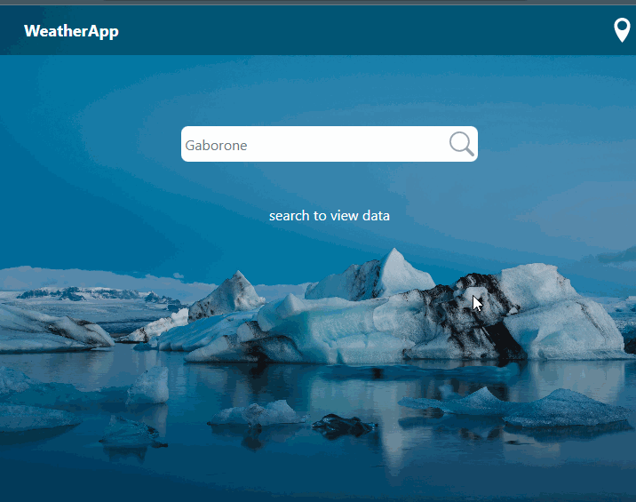

 # Weather app

 A React Weather app with OpenWeatherMap API

## Features

Find any city or place weather forecast

Find user location weather

5 days forecast




### INSTRUCTIONS TO RUN tHIS APP

Clone this repository.

```
https://github.com/norman-chifenga/weather-app
```

Create a .env file at the root directory of the application and add the following variables to it. Register and obtain an API key with openweather.com.
Assign the key to the REACT_APP_KEY

```
REACT_APP_KEY = ''
REACT_APP_URL = 'http://api.openweathermap.org/data/2.5/forecast?'
REACT_APP_ICON_URL = 'http://openweathermap.org/img/w/'
```

Install dependencies
```
npm install
```

To start the development mode run

```
npm run dev
```
To build the application run
```
npm run build
```